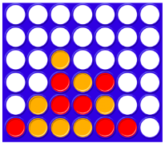
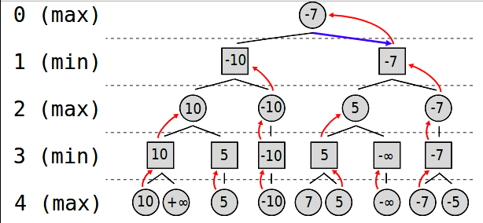

# Connect 4 Game

Programa del juego 4 en raya programado en Haskell. Permite a un usuario jugar contra una IA con 3 niveles de dificultad en un tablero de cualquier tamaño con más de 4 filas y 4 columnas.

## Presentación

El objetivo de 'Conecta 4' o '4 en raya' es alinear cuatro fichas sobre un tablero formado por seis filas y siete columnas. Cada jugador dispone de 21 fichas de un color (por lo general, rojas o amarillas). Por turnos, los jugadores deben introducir una ficha en la columna que prefieran (siempre que no esté completa) y ésta caerá a la posición más baja. Gana la partida el primero que consiga alinear cuatro fichas consecutivas de un mismo color en horizontal, vertical o diagonal. Si todas las columnas están llenas pero nadie ha hecho una fila válida, hay empate.

En este programa, el tamaño del tablero es configurable siempre y cuando tenga más de 4 filas y 4 columnas.



## Ejecutar el juego

Compilar el fichero joc.hs:
```
ghc joc.hs
```
Abrir el ejecutable generado:
```
./joc
```
## Prerequisitos

Para poder compilar es necesario instalar el paquete `random`, ya que es necesario importar `System.random` para generar números aleatorios en una de las estrategias del juego.

En Mac:
```
> brew install cabal-install
> cabal update
> cabal install --lib random
```
En Ubuntu:
```
> sudo apt install cabal-install
> cabal update
> cabal install random
```

## Instrucciones de juego
Primero de todo se debe inicializar la partida, estableciendo el tamaño del tablero, el tipo de estrategia de la IA y el jugador que empieza la partida.

A continuación se muestra un ejemplo de inicialización del juego, creando un tablero de tamaño `6x7`, con estrategia `smart` y con jugador inicial `human` 
```
Welcome to the Connect4 game

Please introduce the number of rows of the board (min. 4)
> 6
Please introduce the number of columns of the board (min. 4)
> 7
Please introduce the strategy of the CPU:
[0] Random (Easy)
[1] Greedy (Medium)
[2] Smart  (Hard)
> 2
Who starts the game?
[0] Human
[1] CPU
> 0
· · · · · · ·
· · · · · · ·
· · · · · · ·
· · · · · · ·
· · · · · · ·
· · · · · · ·
0 1 2 3 4 5 6
Initial Board
Select a column
> 
```
Desde este punto, el usuario debe introducir el número de columna donde desea colocar una ficha. Acto seguido el npc (non-playable character) elegirá su columna en función de la estrategia elegida inicialmente. Después de esto, se escribirá por terminal el tablero actualizado con las dos nuevas fichas. No se debería de introducir una columna ya llena o no existente.

Las fichas del usuario se representan con el carácter `o`, y las del npc se representan con el carcter `x`
```
Select a column
> 3
· · · · · · ·
· · · · · · ·
· · · · · · ·
· · · · · · ·
· · · · · · ·
· · x o · · ·
0 1 2 3 4 5 6
CPU has choosen the column 2
Select a column
> 
```
La partida finaliza cuando haya una victoria o un empate. A continuación se muestra un ejemplo donde el npc gana la partida:
```
· · x o · · ·
· · o x · · ·
· · x x · · ·
· · o x · · ·
· · o o x · ·
· o x o o x ·
0 1 2 3 4 5 6
CPU has choosen the column 5
CPU wins!
```
## Estrategias
El rival del usuario es un npc (non-playable character) que puede comportarse de 3 maneras diferentes, basándose en una de las siguientes estrategias.
### Estrategia Random (nivel fácil)
Cuando el npc debe elegir una columna donde tirar, la elige al azar. Si la columna que ha seleccionado ya est llena elige otra hasta que no sea una columna llena.

Esta estrategia es la que requiere instalar el paquete `random`, que provee las herramientas necesarias para generar números aleatorios.
#### Pros
Estrategia simple y fácil de implementar
#### Contras
Es muy fácil de derrotar, incluso sin tener habilidades en el 4 en raya.

### Estrategia Greedy (nivel medio)
Con esta estrategia, el npc siempre elige la mejor columna en el momento actual. 

Si puede ganar en el turno actual, gana

Sinó, si puede perder en el turno siguiente, lo evita

Sinó, elige la columna donde, colocando ficha, junta el máximo de fichas posibles

Si no puede llegar a juntar 2 fichas, coloca una ficha en la columna donde en la próxima tirada el usuario puede juntar el número más alto de fichas.

Si el npc no consigue ninguno de los objetivos anteriores, elige una columna al azar (que no esté llena)
#### Pros
Es una estrategia que, a diferencia de la `random` actua con un mínimo de inteligencia.

El usuario tiene más probabilidades de perder que con la estrategia `random`. 
#### Contras
Esta estrategia no tiene visión de futuro. En un turno puede escoger una columna que le permite juntar un buen número de fichas, pero que permite al rival ganar en el turno siguiente

### Estrategia Smart (nivel difcil)
Esta estrategia es la más sofisticada de las tres, y la más difícil de derrotar. Está basada en el algoritmo `minimax`.

En un turno se genera un arbol de decisiones con todas las posibles combinaciones de tableros hasta una profundidad máxima.

Los nodos hoja son tableros que, o han alcanzado la profundidad máxima, o contienen un estado final del juego (victoria o empate)

Se puntua cada uno de los nodos hoja y se envía la mejor puntuación al nodo raíz. 

La puntuación de los nodos de profundidad par es el máximo de las puntuaciones de sus hijos.
 
Los nodos de profundidad par pertenecen a turnos de npc, y queremos escoger la jugada que da una puntuación lo más alta posible. Es por eso que los nodos hoja con victoria del npc tienen una puntuación positiva, y cuantas menos fichas necesite para ganar, más alta será la puntuación.

La puntuación de los nodos de profundidad impar es el mínimo de las puntaciones de sus hijos.

Los nodos de profundidad impar pertenecen a turnos del usuario, y por eso escogemos la puntuación más baja posible (debemos suponer que el usuario elegirá siempre la jugada que más perjudique al npc). Es por eso que los nodos hoja con victoria del usuario tienen una puntuación negativa, y cuantas menos fichas necesite para ganar, más baja será la puntuación

Los nodos hoja que no sean un estado final de la partida (ni victoria ni empate) obtienen una puntuación en valor absoluto más baja que las que contienen victoria o empate.

Si un tablero contiene alguna columna llena, no se generan los hijos a los que les correspondería colocar una casilla en dichas columnas.

En caso de empate de puntuaciones en los hijos del nodo raíz con puntuación máxima, se selecciona la columna más cercana al centro del tablero.

La siguiente imagen, extraída de Wikipedia, muestra un ejemplo de árbol de decisiones del algoritmo `minimax`



Para más información, visitar https://es.wikipedia.org/wiki/Minimax
#### Pros
Es una estrategia difcil de derrotar.

Cuando elige una casilla lo hace teniendo en cuenta las posibles jugadas futuras y en base a eso el npc elige la opción más beneficiosa para él.
#### Contras
El tiempo que tarda en decidir una columna es muy elevado. Según la profundidad del árbol, tardará más o menos en decidir una columna. Con una profundidad de 5 en un tablero de 6x7 tarda no más de 2 segundos en decidir (aunque con tableros más grandes el tiempo se eleva). El tiempo de cálculo crece exponencialmente cuando la profundidad se incrementa (aunque cuando el tablero va llenando columnas enteras el factor de ramificación disminuye, y en consecuencia el tiempo de cálculo también disminuye)


## Built With

* [Haskell](https://www.haskell.org/)

## Autor

* **Marcos Gómez Vázquez** - *Facultad de Informática de Barcelona, UPC*
